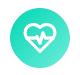
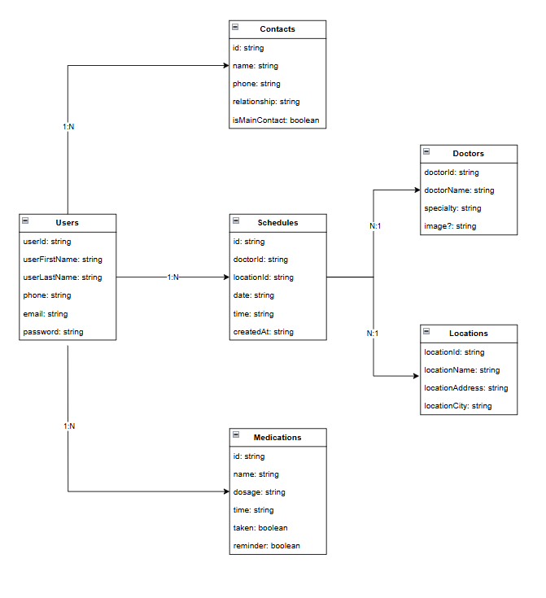
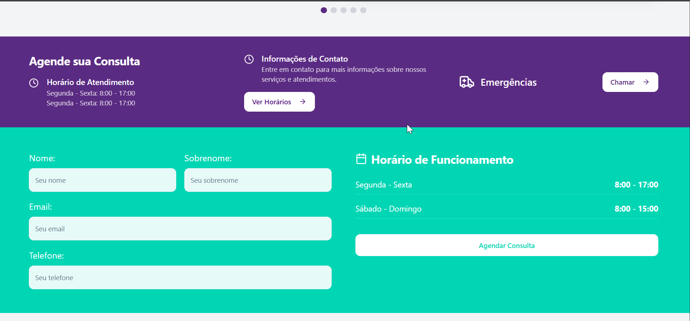
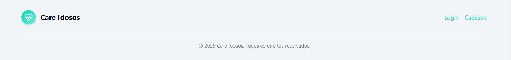

<h1 align="center">
    <br>
    <p align="center" style="font-weight: bold;"> CARE IDOSOS - PI </p>
</h1>

<h1>
    <p style="font-weight: bold;">🧠 Contexto</p>
</h1>

O objetivo foi criar um aplicativo de serviços essenciais aos idosos.

- 🎯 [Objetivo do Projeto](#Objetivo-do-Projeto)
- ⚙️ [Funcionalidades](#funcionalidades)
- 📁 [Arquitetura](#Arquitetura)
- 🔗 [Link do Projeto](#Link-do-Projeto)
- 📊 [Der (Diagrama Entidade-Relacionamento)](#der-diagrama-entidade-relacionamento)
- 💻 [Como rodar o projeto localmente](#Como-rodar-o-projeto-localmente)
- 🎨 [Layout](#Layout)
- 🛠️ [Tecnologias Utilizadas](#tecnologias-utilizadas)
- 👨‍💻 [Colaboradores do Projeto](#colaboradores-do-projeto)
- 📝 [Licença](#licença)

<h1>
    <br>
    <p style="font-weight: bold;">🎯 Objetivo do Projeto</p>
</h1>

O objetivo principal do projeto é oferecer um conjunto de serviços essenciais aos idosos, disponíveis 24 horas por dia. Esses serviços abrangem o gerenciamento de **consultas médicas**, **contatos de emergência**, **administração horário das medicações**, entre outros. A plataforma busca aprimorar a qualidade de vida dos idosos, assegurando acesso rápido, fácil e contínuo a cuidados de saúde e suporte sempre que necessário.

<h1>
  <br>
    <p style="font-weight: bold;">⚙️ Funcionalidades</p>
</h1>

- Acessar a lista de serviços;
- Cadastrar, atualizar e deletar contatos;
- Agendar consultas médicas com profissionais de saúde;
- Solicitar exames e visualizar resultados;
- Acessar contatos de emergência com instituições de saúde e familiares;
- Obter suporte técnico especializado para dispositivos e tecnologias usadas pelos idosos;
- Administração horário das medicações.

<h1>
  <br>
    <p style="font-weight: bold;">📁 Arquitetura  </p>
</h1>

```
📁 Senac-PI
   |-  📁 video
   |-  📁 backend
   |-  📁 imagens
   |-  📁 public
   |-  📁 src
   |    |
   |    |- 📁 Assents
   |    |- 📁 components
   |    |- 📁 hooks
   |    |- 📁 lib
   |    |- 📁 pages
   |    |- 📁 utils
   |    |- 📑 App.css
   |    |- 📑 App.tsx
   |    |- 📑 index.css
   |    |- 📑 main.tsx
   |    |- 📑 vite-env.d.ts
   |
   |
   |- 📑 .gitignore
   |- 📑 DER-PI-SENAC.png
   |- 📑 README.md
   |- 📑 bun.lockb
   |- 📑 components.json
   |- 📑 eslint.config.js
   |- 📑 index.html
   |- 📑 package-lock.json
   |- 📑 package.json
   |- 📑 postcss.config.js
   |- 📑 tailwind.config.ts
   |- 📑 tsconfig.app.json
   |- 📑 tsconfig.json
   |- 📑 tsconfig.node.json
   |- 📑 vite.config.ts
```

<h1>
    <br>
    <p style="font-weight: bold;">🔗 Links do projeto</p>
</h1>

- [Apresentação do projeto - Vídeo](https://youtu.be/g-Kt0c2nNKU?si=CGySjsQp_n3XtCV9)
- [GitHub Pages - Deploy](https://odairgsoares.github.io/care-idosos/)
- [Care Idosos Backend- Github](https://github.com/Biiars00/elderly-care)


<h1>
    <br>
    <p style="font-weight: bold;">✍️ Der (Diagrama Entidade-Relacionamento)</p>
</h1>




<h1>
    <br>
    <p style="font-weight: bold;">💻 Como rodar o projeto localmente</p>
</h1>

Antes de começar, você precisará ter os seguintes softwares instalados:

- Node.js (v18 ou superior)
- npm (gerenciador de pacotes do Node.js)
- vovable (Framework)

| Passo     | Comando/informação       |
| --------- | ----------- |
| Faça o fork  | `botão de forkar` |
| Faça o clone  | `git clone` |
| Instale as dependências   | `npm i` |
| utilize o script de dev    | `npm dev` |

<h1>
    <br>
    <p style="font-weight: bold;">🎨 Layout</p>
</h1>

<p align="center">

</p>
<p align="center">

</p>
<p align="center">

</p>

<h1>
    <p style=" font-weight: bold;">🛠️ Tecnologias Utilizadas</p>
</h1>

- **Vite** 
- **TypeScript** 
- **React** 
- **shadcn-ui** 
- **Tailwind CSS** 
- **Node.js** 
- **TypeScript** 
- **Express.js** 
- **Firebase**
- **Tsoa** 

<h1>
    <p style=" font-weight: bold;">👨‍💻 Colaboradores do Projeto</p>
</h1>

- BEATRIZ RIBEIRO DOS SANTOS
- ELISABETE ALVES DOS SANTOS
- KARENN SOUZA BUENO DE AZEVEDO
- KELVEN MARTINS DA ROSA
- KEVIN LOGAN GOMES PIRES
- MARLU PATROCINIO RAMOS DA SILVA
- ODAIR GOMES SOARES

<h1>
    <p style=" font-weight: bold;">📝 Licença</p>
</h1>

Este projeto está licenciado sob a [MIT License](./LICENSE.txt).


<h3>
  <a href='#top'>🔝 Voltar para o topo.</a>
</h3>

### Feito com 💕 e muita dedicação
