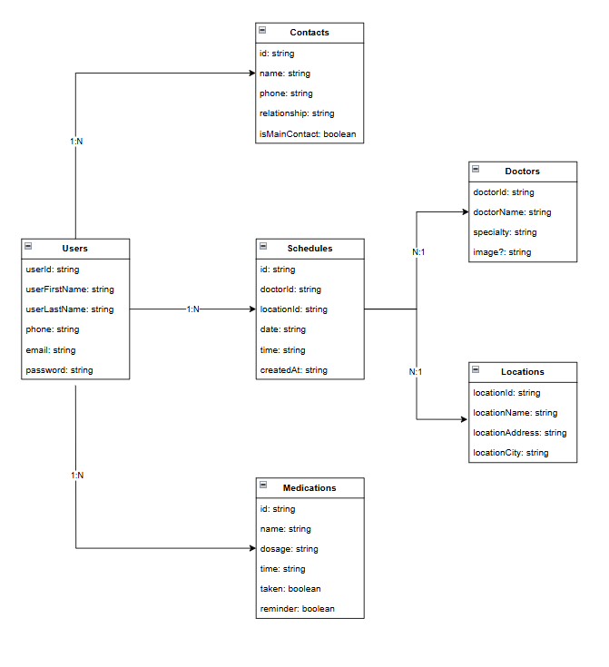

# Care Idosos - Backend

O **Care Idosos** é uma aplicação backend desenvolvida em **Node.js** e **TypeScript**, com integração do banco de dados **Firebase**. O objetivo principal do projeto é oferecer um conjunto de serviços essenciais aos idosos, disponíveis 24 horas por dia. Os serviços incluem gerenciamento de **consultas médicas**, **contatos de emergência**, **horário das medicações** entre outros. A plataforma visa melhorar a qualidade de vida dos idosos, garantindo que eles tenham acesso rápido e fácil a cuidados de saúde e apoio sempre que necessário.

## Índice

- [Tecnologias Utilizadas](#tecnologias-utilizadas)
- [Requisitos](#requisitos)
- [Instalação e Configuração](#instalação-e-configuração)
- [Estrutura de Diretórios](#estrutura-de-diretórios)
- [Como Usar](#como-usar)
- [Endpoints da API](#endpoints-da-api)
- [DER (Diagrama Entidade-Relacionamento)](#der-diagrama-entidade-relacionamento)
- [Colaboradores do Projeto](#colaboradores-do-projeto)
- [Link do Projeto Frontend](#link-do-projeto-frontend)
- [Licença](#licença)

## Tecnologias Utilizadas

- **Node.js** – Ambiente de execução para JavaScript no lado do servidor.
- **TypeScript** – Superset de JavaScript que adiciona tipagem estática ao código.
- **Express.js** – Framework web para Node.js, usado para construir a API RESTful.
- **Firebase** – Banco de dados em tempo real.
- **Tsoa** – Para socumentar a API no Swagger de forma dinâmica.

## Requisitos

Antes de começar, você precisará ter os seguintes softwares instalados:

- [Node.js](https://nodejs.org) (v18 ou superior)
- [npm](https://www.npmjs.com) (gerenciador de pacotes do Node.js)
- Credenciais de acesso para manipulação do banco de dados.

## Instalação e Configuração

1. **Clonar o Repositório**

   Clone este repositório para o seu ambiente local:

   ```bash
   git clone https://github.com/Biiars00/-elderly-care.git

   cd care-idosos-backend

   ```

2. Instalar Dependências

   Instale as dependências necessárias:

   ```bash
   npm install

   ```

3. Configurar Variáveis de Ambiente

- Crie um arquivo `.env` na raiz do projeto com as seguintes variáveis:

  ```bash
  URL_FIREBASE_CREDENTIALS=firebase-api-key
  ```

4. Executar o Servidor:

   ```bash
   npm run dev
   ```

## Estrutura de Diretórios

    elderly-care/
    ├── src/
    │   ├── controllers/
    │   ├── dependencies/
    │   ├── interfaces/
    │   ├── repositories/
    │   ├── routes/
    │   ├── services/
    │   ├── app.ts
    │   └── server.ts
    ├── .env.example
    ├── package.json
    ├── tsconfig.json
    └── README.md

## Endpoints da API

### **Deploy do projeto:** https://elderly-care.onrender.com

| Método                     | Endpoint                            | Descrição                               |
| -------------------------- | ----------------------------------- | --------------------------------------- |
| **Contatos de emergência** |
| POST                       | /contacts                           | Registrar um novo contato de emergência |
| DELETE                     | /contacts/:id                       | Remover um contato de emergência        |
| PUT                        | /contacts/:id                       | Atualizar um contato existente          |
| GET                        | /contacts/:id                       | Buscar um contato                       |
| GET                        | /contacts                           | Listar todos os contatos                |
| **Consultas**              |
| POST                       | /appointment                        | Agendar uma nova consulta/exame         |
| DELETE                     | /appointment/:id                    | Remover uma consulta                    |
| PUT                        | /appointment/:id                    | Atualizar uma consulta                  |
| GET                        | /appointment/:id                    | Buscar uma consulta                     |
| GET                        | /appointment                        | Listar todos as consultas               |
| PUT                        | /appointment/confirmed/:id          | Confirmar consulta                      |
| **Médicos**                |
| GET                        | /doctor/doctorId                    | Buscar um médico                        |
| GET                        | /doctor                             | Buscar todos os médicos                 |
| **Clínicas**               |
| GET                        | /location/locationId                | Buscar uma clínica                      |
| GET                        | /location                           | Buscar todos as clínicas                |
| **Medicamentos**           |
| GET                        | /medication/:id                     | Buscar uma medicamento                  |
| GET                        | /medication                         | Buscar todos os medicamentos            |
| POST                       | /medication                         | Adicionar um novo medicamento           |
| DELETE                     | /medication/:id                     | Remover um medicamento                  |
| PUT                        | /medication/:id                     | Atualizar um medicamento                |
| **Usuários**           |
| GET                        | /user/:userId                       | Buscar um usuário  (Autenticação)       |
| POST                       | /user/sign-up                       | Adicionar um novo usuário               |
| GET                        | /user                               | Listar usuários                         |
| POST                       | /user/login                         | Realizar login do usuário               |

## DER (Diagrama Entidade-Relacionamento)


## Colaboradores do Projeto

- BEATRIZ RIBEIRO DOS SANTOS
- ELISABETE ALVES DOS SANTOS
- KARENN SOUZA BUENO DE AZEVEDO
- KELVEN MARTINS DA ROSA
- KEVIN LOGAN GOMES PIRES
- MARLU PATROCINIO RAMOS DA SILVA
- ODAIR GOMES SOARES

## Links do Projeto Front-end

- [Care Idosos - Deploy](https://care-idosos-connect.vercel.app/)
- [Care Idosos - Github](https://github.com/OdairGSoares/care-idosos-connect)

## Licença

Este projeto está licenciado sob a [MIT License](./LICENSE.txt).
